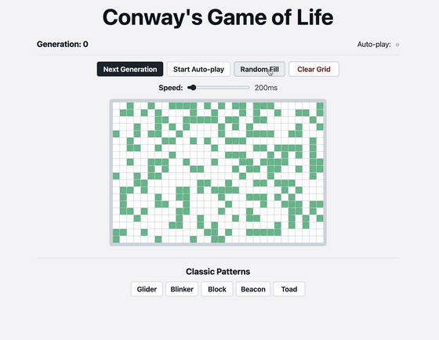

# Conway's Game of Life

A simple browser-based implementation of Conway's Game of Life, written in Go.



## Run

```bash
go run .
```

Then open http://localhost:8080.

## Features

- Click cells to toggle them
- Step through generations manually or auto-play
- Adjustable speed
- Random fill and clear
- A few classic starting patterns
